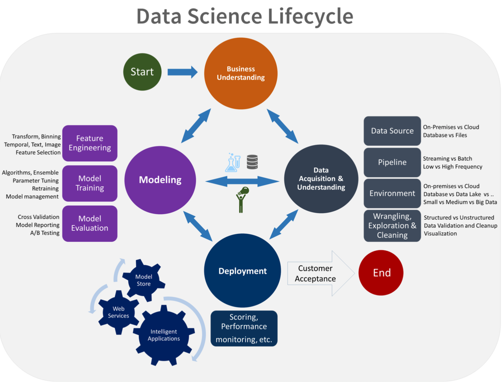
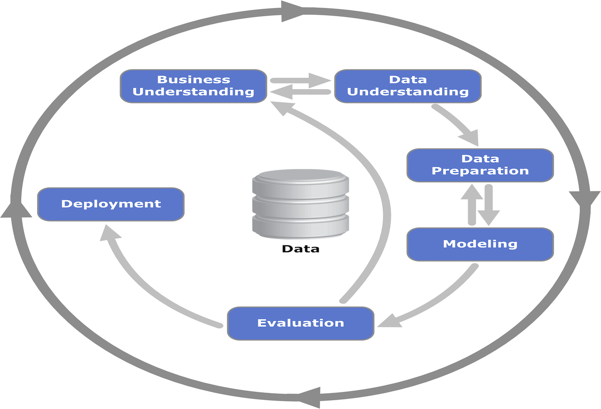

```{r setup, include=FALSE}
knitr::opts_chunk$set(echo = TRUE)
```

## Introduction

On the day we started discussing workflows, I asked the class what they considered to be the steps of a data science 
workflow. For the most part, they nailed it:   
- Problem   
- Data Steps   
- Model   
- Business process integeration    

Great. What was I supposed to teach for next five weeks.

Truthfully this result was not surpising. Students are taught the scientific method early on in their education. 
This systematic apporach serves as an excellnt framework for approaching scientific inquiries and many of the established
data sceince workflows are organized similar. 

|Scientific Method|Data Science Workflow|
|-----------------|----------------------|
|Formulation of a question|Business Understanding|   
|Hypothesis|Business Understanding|   
|Prediction|Business Understanding|   
|Testing|Modeling|   
|Analysis|Data Understanding|

Data science is the confluence of several fields, most noteably computer science and mathematics/statistics. In both 
these fields, formal education generally teaches the application of many different skills. Unfortunately, in practice 
this translates to what fancy new mehtods are we going use rather than asking the question what are the outcomes we
will enable. The hype train around data sceince has monitized the terms data science, macnine learning, and AI to the 
extent that the fields has evolved from being problem focused to tools/method focused. 

**Data Science should always be focused on providing useful insight.** 

***
## Iteration
We start with the notation of iteration. Very often, actually almost always, when developing data science solutions, 
we are faced with latet issues not originally considered. When these problems are realized, we want to be working in a 
flexible framework that allows for the further development without a full reset. It's also possible that once the 
modeling is underway, more data will be required or better models will be considered. Whatever the case, we want to 
remain flexible enought to go back to past steps.

By some standards, this could be considered unoffically a form of agile development without the project management 
standards (though they could be certianly included).

**Advantages:**   
- Allows room for additional pieces of insight to improve data gathering or modeling building.    
- If deadlines approach, we know we have a viable product ready to roll.   

***
## Scoping the Problem
The most underrated step in the process is properly scoping the business problem. Often busines problems are viewed 
throught the lense of techniques and methods rather than the conditons of the problems. 

#### Business Undersatnding 

Typical business conditions requiring the expertise of data scientists: 
- A business stakeholder has a question that requires advanced analytical methods   
- A function within the business can be enhanced through the application of data science       
- A tool purchased from a third party is to be brought in-house       
- New inights are need to ehance current products or processs     

It's worth noting that data scientists shoud be proactive in working with your customer and other stakeholders 
to help identify the business problems. Often the exposure to other data science solutions either in research or 
experience give data scientsts a keen eye for identifying potential applications.

This first and critical step should envolve immersion into the business domain to fully understand the the application.
From here, we can start to:
 - Identify what the key business variables that the analyis/solution will examine/predict? These can be refered to as 
 model targets, the dependent variables, the variate, or simply *y*.      
 - Formulate questions that define the business goals that the data science techniques can target.    
 - Understand how the business will define success?     

This should enable the data science team to development of an analytical defination of the problem and success metric
that makes sense to both the business and data science team

#### Examine Previous Work

Evaluating previous work will give the data scientsts a indentidy what has been previously completed - methods, data - 
as well as what the shortcomings for those approaches,if any, were.

As a brief aside, a good stratgey for making data science efforts more discoverable is to use markdown to document 
each step of the process.


#### Identify Data Sources: 
Once we've defined the objectives of the problme, we need to identify the relevant data that helps you answer the 
questions that support the objectives of the project. This should be considered data scoping rather that data gathering.

#### Success Metrics
Microsoft Team DS provdes some useful inslight into defining success metrics stating that the metrics must be SMART:  
      **S**pecific    
      **M**easurable    
      **A**chievable    
      **R**elevant    
      **T**ime-bound   

At the conclusion of scoping the problem, the data science team should be able to answer the following questions:   
**"What is the system-level problem to be solved and why is it important?"**      
**"What is the benefit to the business?"**     
**"How will success be measured?"**     
**"What are the shortfalls of the current and previous approaches?"**     
**"What is the nature of the solution to be provided?"**     
**"What specific technologies are needed"**       
**"What will be developed?"**      
**"What are the difficulties to be encountered?"**   


***
## Data Acquisition & Understanding 
Once we've scoped the problem successfually, we need to being the data collection and understanding phase. Much of the
"data wrangeling" and "data exploration" are completed during this phase.


## Modeling

## Deployment

## Appendix
Popular data science workflows:   
**Microsoft Team Data Science Process**   
   
**CRISP-DM - Cross-industry Standard Process for Data Mining**    
     

## References
[Development Workflows for Data Scientists](https://resources.github.com/downloads/development-workflows-data-scientists.pdf)   
[Guidance for Preparing White Papers and Proposals - Office of Naval Research](https://www.onr.navy.mil/-/media/Files/33/Guidance-USW-GnC-DnI-FY15.ashx?la=en&hash=30ADDBA56AB76036033CDD750987F1DC8EF5366B)      
[Microsoft Team Data Science Process](https://docs.microsoft.com/en-us/azure/machine-learning/team-data-science-process/overview)    
