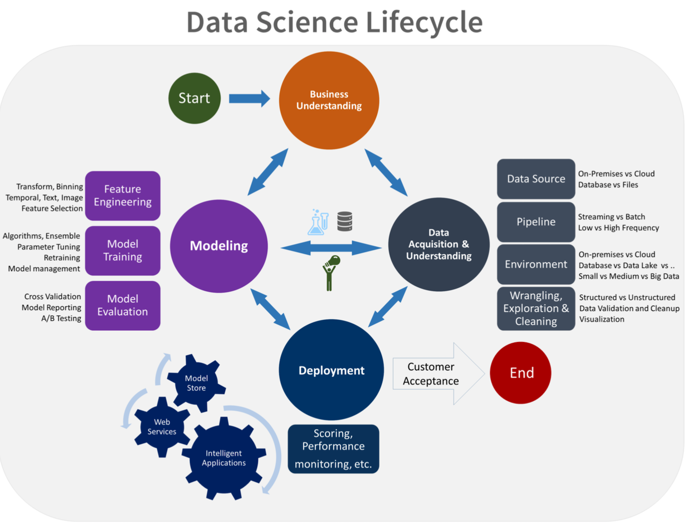
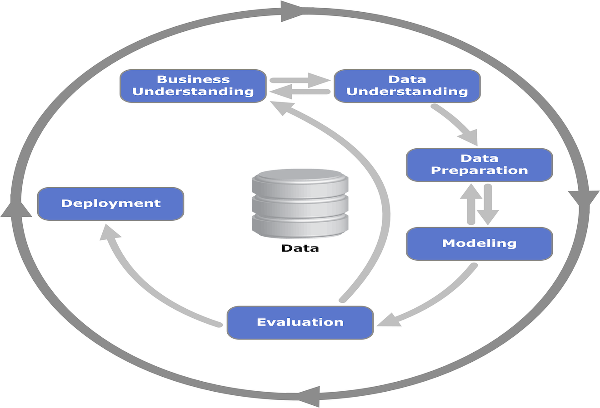

Data Science Workflows
================
Chip Galusha
3/24/2019

-   [Introduction](#introduction)
-   [Iteration](#iteration)
-   [Scoping the Problem](#scoping-the-problem)
    -   [Business Undersatnding](#business-undersatnding)
    -   [Examine Previous Work](#examine-previous-work)
    -   [Identify Data Sources:](#identify-data-sources)
    -   [Success Metrics](#success-metrics)
-   [Data Acquisition & Understanding](#data-acquisition-understanding)
    -   [Goals](#goals)
    -   [How to do it](#how-to-do-it)
    -   [Ingest the data](#ingest-the-data)
    -   [Explore the data](#explore-the-data)
    -   [Set up a data pipeline](#set-up-a-data-pipeline)
    -   [Useful R Packages](#useful-r-packages)
-   [Modeling](#modeling)
    -   [Understanding how will the model be used in Production?](#understanding-how-will-the-model-be-used-in-production)
    -   [Model Building](#model-building)
    -   [Feature Engineering](#feature-engineering)
    -   [Comparing Model Performance](#comparing-model-performance)
-   [Deployment](#deployment)
-   [Process Monitoring](#process-monitoring)
-   [Appendix](#appendix)
-   [Useful Resources](#useful-resources)
-   [References](#references)

Introduction
------------

On the day we started discussing workflows, I asked the class what they considered to be the steps of a data science workflow. For the most part, they nailed it:
- Problem
- Data Steps
- Model
- Business process integeration

Great. What was I supposed to teach for next five weeks.

Truthfully this result was not surpising. Students are taught the scientific method early on in their education. This systematic apporach serves as an excellnt framework for approaching scientific inquiries and many of the established data sceince workflows are organized similar.

| Scientific Method         | Data Science Workflow  |
|---------------------------|------------------------|
| Formulation of a question | Business Understanding |
| Hypothesis                | Business Understanding |
| Prediction                | Business Understanding |
| Testing                   | Modeling               |
| Analysis                  | Data Understanding     |

Data science is the confluence of several fields, most noteably computer science and mathematics/statistics. In both these fields, formal education generally teaches the application of many different skills. Unfortunately, in practice this translates to what fancy new mehtods are we going use rather than asking the question what are the outcomes we will enable. The hype train around data sceince has monitized the terms data science, macnine learning, and AI to the extent that the fields has evolved from being problem focused to tools/method focused.

**Data Science should always be focused on providing useful insight.**

------------------------------------------------------------------------

Iteration
---------

We start with the notation of iteration. Very often, actually almost always, when developing data science solutions, we are faced with latet issues not originally considered. When these problems are realized, we want to be working in a flexible framework that allows for the further development without a full reset. It's also possible that once the modeling is underway, more data will be required or better models will be considered. Whatever the case, we want to remain flexible enought to go back to past steps.

By some standards, this could be considered unoffically a form of agile development without the project management standards (though they could be certianly included).

**Advantages:**
- Allows room for additional pieces of insight to improve data gathering or modeling building.
- If deadlines approach, we know we have a viable product ready to roll.

------------------------------------------------------------------------

Scoping the Problem
-------------------

The most underrated step in the process is properly scoping the business problem. Often busines problems are viewed throught the lense of techniques and methods rather than the conditons of the problems.

#### Business Undersatnding

Typical business conditions requiring the expertise of data scientists: - A business stakeholder has a question that requires advanced analytical methods
- A function within the business can be enhanced through the application of data science
- A tool purchased from a third party is to be brought in-house
- New inights are need to ehance current products or processs

It's worth noting that data scientists shoud be proactive in working with your customer and other stakeholders to help identify the business problems. Often the exposure to other data science solutions either in research or experience give data scientsts a keen eye for identifying potential applications.

This first and critical step should envolve immersion into the business domain to fully understand the the application. From here, we can start to: - Identify what the key business variables that the analyis/solution will examine/predict? These can be refered to as model targets, the dependent variables, the variate, or simply *y*.
- Formulate questions that define the business goals that the data science techniques can target.
- Understand how the business will define success?

This should enable the data science team to development of an analytical defination of the problem and success metric that makes sense to both the business and data science team

#### Examine Previous Work

Evaluating previous work will give the data scientsts a indentidy what has been previously completed - methods, data - as well as what the shortcomings for those approaches,if any, were.

As a brief aside, a good stratgey for making data science efforts more discoverable is to use markdown to document each step of the process.

#### Identify Data Sources:

Once we've defined the objectives of the problme, we need to identify the relevant data that helps you answer the questions that support the objectives of the project. This should be considered data scoping rather that data gathering.

#### Success Metrics

Microsoft Team DS provdes some useful inslight into defining success metrics stating that the metrics must be SMART:
**S**pecific
**M**easurable
**A**chievable
**R**elevant
**T**ime-bound

At the conclusion of scoping the problem, the data science team should be able to answer the following questions:
**"What is the system-level problem to be solved and why is it important?"**   
**"What is the benefit to the business?"** 
**"How will success be measured?"** 
**"What are the shortfalls of the current and previous approaches?"** 
**"What is the nature of the solution to be provided?"**   
**"What specific technologies are needed"**   
**"What will be developed?"**   
**"What are the difficulties to be encountered?"**    

------------------------------------------------------------------------

Data Acquisition & Understanding
--------------------------------

Once we've scoped the problem successfually, we need to begin the data collection and understanding phase. Much of the "data wrangeling" and "data exploration" are completed during this phase. It's widly considered the most tedious and time consuming element when developing data science solutions. Most of this section is from the Microsoft Team Data Science Workflow documentation(See references).

#### Goals

Produce a clean, high-quality data set whose relationship to the target variables is understood. Locate the data set in the appropriate analytics environment so you are ready to model.Develop a solution architecture of the data pipeline that refreshes and scores the data regularly.

#### How to do it

There are three main tasks addressed in this stage: - Ingest the data into the target analytic environment.
- Explore the data to determine if the data quality is adequate to answer the question.
- Set up a data pipeline to score new or regularly refreshed data.

#### Ingest the data

Set up the process to move the data from the source locations to the target locations where you run analytics operations, like training and predictions.

#### Explore the data

Before you train your models, you need to develop a sound understanding of the data. Real-world data sets are often noisy, are missing values, or have a host of other discrepancies. You can use data summarization and visualization to audit the quality of your data and provide the information you need to process the data before it's ready for modeling. R Shiny is a fantastic tool for devloping EDA applications that can facilitate quick analysis.

#### Set up a data pipeline

In addition to the initial ingestion and cleaning of the data, you typically need to set up a process to score new data or refresh the data regularly as part of an ongoing learning process. You do this by setting up a data pipeline or workflow. Depending on your business needs and the constraints of your existing systems into which this solution is being integrated, the pipeline can be one of the following:Batch-based Streaming or real time, or A hybrid.

#### Useful R Packages

[dplyr](https://dplyr.tidyverse.org) &gt; data manipulation
[tidyr](https://tidyr.tidyverse.org) &gt; Make your data tidy
[purrr](https://tidyr.tidyverse.org) &gt; Enhance R's functional programming
[lubridate](https://lubridate.tidyverse.org) &gt; Take the tears out of working with dates
[stringr](https://stringr.tidyverse.org) &gt; String manipulations
[readr](https://readr.tidyverse.org) &gt; Reading data
[forcats](https://forcats.tidyverse.org) &gt; Solve common problems with factors

Modeling
--------

Most data scientists would agree that the most enjoyable element of developing data science workflows is the modeling process. The goal for this phase is build a predictive model or ensamble of models that are sutible for prodction and meet the requirments established when scoping the problem.

#### Understanding how will the model be used in Production?

#### Model Building

If you're taking a machine learning approach to buidling models, it's a good idea to split your data set into a "traning" set - used to fit the model - and "test" set - used to evalute the the performance.

But what do you if you're trying multiple models.

#### Feature Engineering

#### Comparing Model Performance

If your trying

Deployment
----------

Comming Soon.

Process Monitoring
------------------

Comming Soon.

Appendix
--------

Popular data science workflows:
**Microsoft Team Data Science Process**

**CRISP-DM - Cross-industry Standard Process for Data Mining**

Useful Resources
----------------

[R for Data Science](https://r4ds.had.co.nz)

References
----------

[Development Workflows for Data Scientists](https://resources.github.com/downloads/development-workflows-data-scientists.pdf)
[Guidance for Preparing White Papers and Proposals - Office of Naval Research](https://www.onr.navy.mil/-/media/Files/33/Guidance-USW-GnC-DnI-FY15.ashx?la=en&hash=30ADDBA56AB76036033CDD750987F1DC8EF5366B)
[Microsoft Team Data Science Process](https://docs.microsoft.com/en-us/azure/machine-learning/team-data-science-process/overview)
