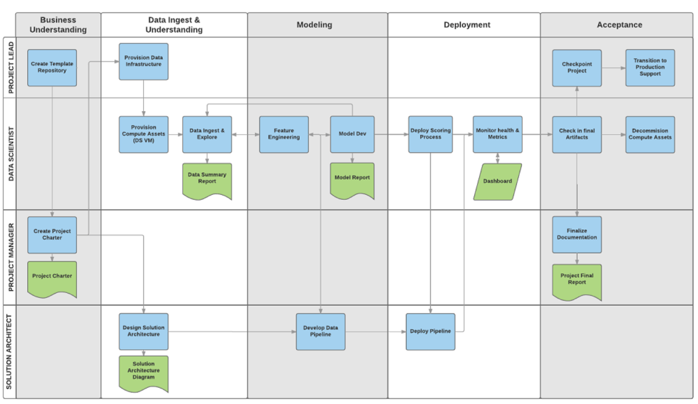
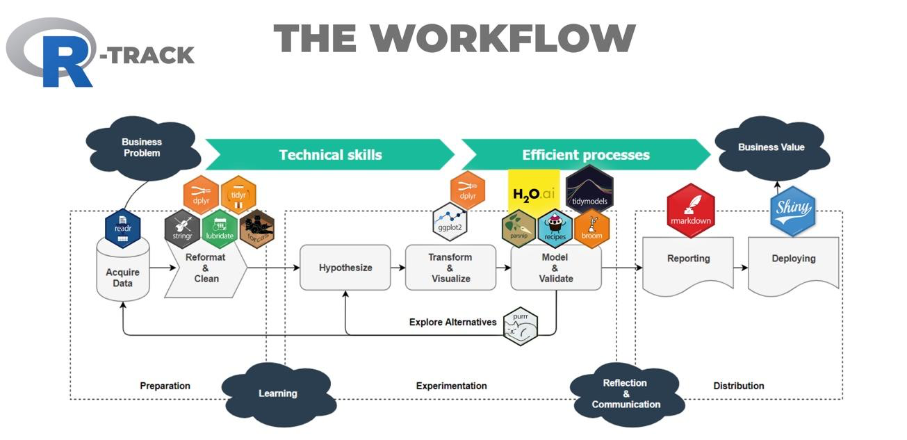
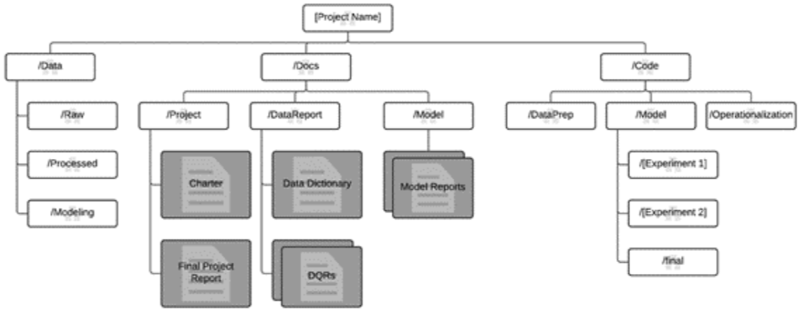

Data Science Workflows
========================================================
author: Chip Galusha    
date: 3/18/2019
autosize: true

Workflows
========================================================

"A workflow is the **definition**, **execution**, and **automation of business processes** toward the goal of coordinating tasks and information between people and systems."    

- Define
- Excute 
- Automate

Popular Workflows: CRISP DM
========================================================
CRISM DM > Cross-industry standard process for data mining

Popular Workflows: Harvard DS course process  
========================================================

Popular Workflows: Microsoft Team Data Science Process
========================================================

Popular Workflows: Microsoft Team Data Science Process - Detailed View
========================================================

Workflows & R
========================================================

<Cool Image w/ R Packages>

Workflow Directory Organization 
========================================================

Business Understanding - Goals
======================================================= 

1. Specify the key variables that are to serve as the model targets and whose       
   related metrics are used determine the success of the project.       
2. Identify the relevant data sources that the business has access to or needs    
   to obtain.   

Business Understanding - How To Do It
======================================================= 
** Define objectives:**     
- Understand and identify the business problems.    
- Formulate questions that define the business goals that the data science techniques can target.     
Identify data sources:    
- Find the relevant data that helps you answer the questions that define the objectives of the project.   

<!-- Business Understanding - Define objectives -->
<!-- ======================================================== -->
<!-- 1. A central objective of this step is to identify the key business variables that the analysis needs to predict. We refer to these variables as the model targets, and we use the metrics associated with them to determine the success of the project. Two examples of such targets are sales forecasts or the probability of an order being fraudulent. -->
<!-- 2. Define the project goals by asking and refining "sharp" questions that are relevant,specific,and unambiguous. Data science is a process that uses names and numbers to answer such questions. For more information on asking sharp questions, see the How to do data science blog. You typically use data science or machine learning to answer five types of questions: -->
<!-- How much or how many? (regression) -->
<!-- Which category? (classification) -->
<!-- Which group? (clustering) -->
<!-- Is this weird? (anomaly detection) -->
<!-- Which option should be taken? (recommendation) -->
<!-- Determine which of these questions you're asking and how answering it achieves your business goals. -->
<!-- 3. Definetheprojectteambyspecifyingtherolesandresponsibilitiesofitsmembers.Developahigh-level milestone plan that you iterate on as you discover more information. -->
<!-- 4. Definethesuccessmetrics.Forexample,youmightwanttoachieveacustomerchurnprediction.Youneed an accuracy rate of "x" percent by the end of this three-month project. With this data, you can offer customer promotions to reduce churn. The metrics must be SMART: -->
<!-- Specific Measurable Achievable Relevant Time-bound -->

